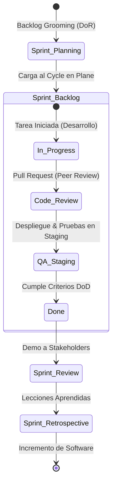

# 02. Gestión Ágil del Proyecto

## 🛠 Metodología Ágil (Scrum) y Gestión en Plane

El proyecto se ejecutará bajo el marco de trabajo **Scrum**, garantizando entregas incrementales y adaptación continua. La gestión integral (Project Management) se realizará en **Plane** (plane.so), que actuará como nuestra única fuente de verdad.

*   **Estructura en Plane:**
    *   **Epics:** Agruparán grandes módulos (ej. "Sistema de Autenticación", "Gestión Bibliográfica", "Módulos de Laboratorio").
    *   **Cycles (Sprints):** Iteraciones de desarrollo de tiempo fijo (ej. 2 a 3 semanas) donde se ejecutarán tareas específicas.
    *   **Issues:** Historias de usuario, tareas técnicas y bugs. Todas deben estar estimadas (Puntos de Historia) y asignadas a un Cycle.

*   **Ceremonias:**
    *   *Sprint Planning:* Al inicio de cada Cycle para definir el *Sprint Backlog* desde Plane.
    *   *Daily Scrum:* Sincronización asíncrona mediante actualizaciones de estado en los Issues de Plane.
    *   *Sprint Review / Retrospective:* Reunión semanal (viernes 9:00 PM) para revisar entregables y bloqueos.

### Flujo de Trabajo en Plane (Scrum Workflow)

## 🚩 Producto Mínimo Viable (MVP)

La primera versión funcional (V1.0) se centrará en la operatividad core:
*   Autenticación de usuarios y perfiles básicos.
*   Búsqueda y visualización de documentos académicos (PDF).
*   Carga de recursos por docentes con flujo de aprobación manual por Admin.
*   Acceso a 4 módulos iniciales de laboratorio.
*   Registro de logs críticos (Inicios de sesión, lecturas, accesos a labs).

## 🧪 Historias de Usuario (Scrum)

| ID | Historia de Usuario | Criterios de Aceptación (DoD) |
| :--- | :--- | :--- |
| **HU01** | Como **estudiante**, quiero buscar recursos por tema para encontrar material rápidamente. | 1. Búsqueda por título/autor/etiqueta. 2. Paginación de resultados. 3. Uso de caché Redis. |
| **HU02** | Como **docente**, quiero subir guías y manuales para compartir material con mis alumnos. | 1. Validación de MIME y tamaño. 2. Estado inicial "Pendiente". 3. Almacenamiento UUID en S3. |
| **HU03** | Como **administrador**, quiero revisar registros de actividad para auditar el uso de la plataforma. | 1. Filtro por fecha y usuario. 2. Detalle de IP y acción. 3. Visualización de reportes. |
| **HU04** | Como **administrador**, quiero aprobar recursos subidos para garantizar la calidad académica. | 1. Listado de pendientes. 2. Previsualización del archivo. 3. Cambio de estado a "Aprobado". |

## 🏗️ Estándares Metodológicos (DoR / DoD)

### 📋 Estructura de Historia de Usuario (Plantilla)
Toda Historia de Usuario en Plane debe estructurarse del siguiente modo:
*   **Título:** Breve y descriptivo (ej: *HU02 - Carga segura de documentos*).
*   **Narrativa:**
    > **Como** [Rol del usuario]  
    > **Quiero** [Realizar una acción/funcionalidad]  
    > **Para** [Obtener un beneficio o valor de negocio]
*   **Estimación:** Puntos de historia en base a la escala Fibonacci modificado (1, 2, 3, 5, 8, 13).
*   **Criterios de Aceptación:** Listado de condiciones medibles de éxito en formato *Dado que... Cuando... Entonces...* o viñetas claras.

---

### 🟢 Definition of Ready (DoR)
Un issue está listo para entrar a un Cycle si cumple con:
- [ ] Está redactada siguiendo el formato estándar de Historia de Usuario.
- [ ] Tiene Criterios de Aceptación (AC) definidos y sin ambigüedades.
- [ ] Ha sido estimada en consenso por el equipo técnico.
- [ ] Se han identificado y documentado sus dependencias técnicas (BD, APIs, frontend).
- [ ] No tiene bloqueos externos activos.

---

### 🏁 Definition of Done (DoD)
Una historia se considera finalizada y lista para entrega de incremento si cumple con:
- [ ] **Desarrollo:** Código limpio, sin comentarios temporales (`TODO`) y siguiendo los estándares del linter (PEP 8 para Python / ESLint para React).
- [ ] **Revisión de Código:** Aprobado al menos por un revisor (Peer Review) mediante Pull Request.
- [ ] **Pruebas:** 100% de pruebas unitarias locales y de integración ejecutadas con éxito.
- [ ] **Staging:** Desplegado en el entorno de QA/Staging bajo Kubernetes y verificado visual y funcionalmente.
- [ ] **Seguridad:** Pasa las comprobaciones automáticas de dependencias y no viola la matriz RBAC.
- [ ] **Documentación:** API documentada dinámicamente con Swagger/OpenAPI y código documentado internamente si aplica.

## 📅 Cronograma por Ciclos (Cycles)

| Ciclo | Duración | Actividades Principales | Entregable |
| :--- | :--- | :--- | :--- |
| **Cycle 1** | Semanas 1-2 | Repositorio, Docker, CI/CD, Cloudflare Tunnel. | Infraestructura base lista. |
| **Cycle 2** | Semanas 3-4 | Login, JWT, Usuarios, Roles y Permisos. | Módulo de Autenticación. |
| **Cycle 3** | Semanas 5-6 | Biblioteca: API de búsqueda, filtros y UI base. | Biblioteca funcional. |
| **Cycle 4** | Semanas 7-8 | Subida de archivos segura y Object Storage. | Gestión documental completa. |
| **Cycle 5** | Semanas 9-10 | Módulos de laboratorio y trazabilidad (Logs). | Laboratorio interactivo. |
| **Cycle 6** | Semanas 11-12 | Dashboard, Pruebas E2E, Ajustes y Despliegue. | Versión Final (Release). |

---
*Este documento constituye la guía base del proyecto y podrá ser actualizado de manera controlada.*
