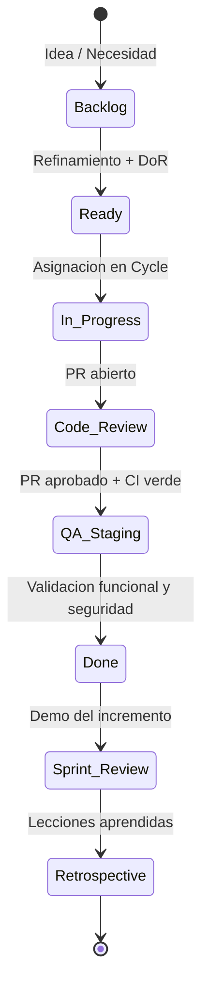

# 02. Gestion Agil y Plan de Ejecucion del Proyecto

## Proposito del Plan

Este documento define el plan ejecutable para construir la plataforma digital FIQ-UNCP usando Scrum, Plane como fuente unica de verdad y un flujo tecnico alineado al stack del proyecto: React 19, TypeScript 6, Vite 8, Tailwind v4, FastAPI, SQLAlchemy 2.0, PostgreSQL 17, Redis 7, Docker Compose y Kubernetes.

El objetivo es que cada Cycle entregue software verificable, con criterios claros de aceptacion, pruebas, seguridad y despliegue. El plan evita historias ambiguas y convierte el alcance funcional en backlog priorizado, dependencias tecnicas y puertas de calidad.

## Metodologia Scrum en Plane

El proyecto se ejecutara bajo Scrum con iteraciones de 2 semanas. Plane sera la unica fuente de verdad para Epics, Cycles, Issues, estimaciones, responsables y estado de avance.

### Estructura de Plane

| Nivel | Uso | Regla Operativa |
| :--- | :--- | :--- |
| **Project** | Plataforma Digital FIQ-UNCP | Contiene todo el producto, backlog y ciclos. |
| **Epics** | Modulos grandes de producto | Agrupan funcionalidades completas: Auth, Biblioteca, Labs, Admin, Infra. |
| **Cycles** | Sprints de 2 semanas | Solo incluyen Issues que cumplen DoR. |
| **Issues** | Historias, tareas tecnicas y bugs | Deben tener estimacion, responsable, AC y dependencias. |
| **Views** | Seguimiento por rol o modulo | Vistas recomendadas: Backend, Frontend, QA/Security, DevOps, Bloqueados. |

### Flujo de Trabajo

### Cadencia de Ceremonias

| Ceremonia | Frecuencia | Responsable | Salida Esperada |
| :--- | :--- | :--- | :--- |
| **Backlog Refinement** | 1 vez por semana | Product Owner | Historias listas, dependencias identificadas y estimacion preliminar. |
| **Sprint Planning** | Inicio de cada Cycle | Scrum Master | Cycle cerrado con Issues asignados y capacidad validada. |
| **Daily Scrum** | Asincrono, lunes a viernes | Cada responsable | Actualizacion en Plane: hecho, siguiente paso, bloqueo. |
| **Code Review** | Por cada PR | Par tecnico | Aprobacion tecnica y verificacion de gates. |
| **Sprint Review** | Viernes de cierre, 9:00 PM | Product Owner | Demo funcional con evidencias. |
| **Retrospective** | Despues del Review | Scrum Master | Acciones concretas para el siguiente Cycle. |

## Roles y Responsabilidades

| Integrante | Rol Scrum | Especialidad | Responsabilidades |
| :--- | :--- | :--- | :--- |
| **Palomino Chacon Hernando De** | Product Owner | Backend | Priorizacion, reglas de negocio, FastAPI, SQLAlchemy, PostgreSQL, OpenAPI. |
| **Moran de la Cruz Jhulio Alessandro** | Scrum Master | Frontend | Gestion del Cycle, React, TypeScript, Tailwind, shadcn/ui, experiencia de usuario. |
| **Pando Vargas Josue Samuel** | QA / Security | DevOps | Docker, Kubernetes, Cloudflare, CI/CD, pruebas E2E, seguridad y observabilidad. |

### Matriz RACI

| Actividad | Product Owner / Backend | Scrum Master / Frontend | QA-Security / DevOps |
| :--- | :---: | :---: | :---: |
| Priorizacion del backlog | A/R | C | C |
| Diseno API y contratos | A/R | C | C |
| Implementacion backend | A/R | C | C |
| Implementacion frontend | C | A/R | C |
| Modelo de datos y migraciones | A/R | C | C |
| Pruebas unitarias backend | A/R | C | C |
| Pruebas UI y E2E | C | R | A/R |
| Seguridad de archivos y RBAC | R | C | A/R |
| Docker, CI/CD y Kubernetes | C | C | A/R |
| Demo y aceptacion funcional | A/R | R | C |

## Producto Minimo Viable

La version V1.0 se considera aceptable cuando existan los siguientes flujos completos:

- Autenticacion JWT con access token, refresh token y RBAC para Admin, Docente y Estudiante.
- Biblioteca con busqueda, filtros dinamicos, paginacion, facetas, detalle de recurso y contadores de vistas y descargas.
- Carga multipart de recursos por Docente/Admin con validacion de archivo y estado inicial Pendiente.
- Revision administrativa de recursos pendientes con acciones Aprobar y Observar.
- Laboratorios virtuales con 4 modulos iniciales visibles por nivel de dificultad.
- Auditoria de eventos criticos: login, busqueda, subida, descarga, visualizacion, aprobacion y acceso a laboratorio.
- Despliegue local por Docker Compose, staging en Kubernetes y acceso controlado con Cloudflare Tunnel.

## Epics del Proyecto

| Epic | Objetivo | Resultado Medible |
| :--- | :--- | :--- |
| **E01 - Fundacion Tecnica** | Preparar repositorio, tooling, contenedores y CI base. | `npm run build`, `uv run pytest`, lint y Docker Compose funcionando. |
| **E02 - Autenticacion y RBAC** | Gestionar login, sesiones y permisos por rol. | Usuarios autenticados con access/refresh token y restricciones 401/403 correctas. |
| **E03 - Biblioteca Digital** | Permitir busqueda, visualizacion y consumo de recursos academicos. | Recursos aprobados listados con search, filtros, detalle y tracking funcional. |
| **E04 - Gestion Documental** | Permitir carga segura, revision y publicacion de recursos. | Docentes suben archivos y Admin aprueba/observa con historial. |
| **E05 - Laboratorios Virtuales** | Publicar modulos interactivos organizados por nivel. | 4 modulos activos accesibles y trazados. |
| **E06 - Panel Admin y Reportes** | Dar visibilidad operativa a administradores. | Dashboard con pendientes, metricas de uso y logs filtrables. |
| **E07 - Seguridad e Infraestructura** | Endurecer aplicacion y preparar despliegue productivo. | Kubernetes, Cloudflare Tunnel, backups, rate limit y alertas configuradas. |

## Backlog Priorizado

### E01 - Fundacion Tecnica

| ID | Historia / Tarea | Est. | Responsable | Dependencias | Criterios de Aceptacion |
| :--- | :--- | :---: | :--- | :--- | :--- |
| **T01** | Como equipo, queremos estructura de monorepo validada para trabajar frontend, backend e infra sin ambiguedad. | 3 | Scrum Master | Ninguna | Carpetas `frontend/`, `backend/`, `docs/` y raiz con tooling documentado; README indica comandos base. |
| **T02** | Como equipo, queremos Docker Compose local para levantar API, DB, Redis y frontend. | 5 | QA/DevOps | T01 | `docker compose up` levanta servicios; healthchecks definidos; `.env.example` documenta variables. |
| **T03** | Como equipo, queremos CI base para PRs. | 5 | QA/DevOps | T01 | Workflow ejecuta lint, typecheck, tests y build; falla si hay errores. |
| **T04** | Como equipo, queremos hooks de calidad Git. | 2 | Scrum Master | T01 | Husky ejecuta lint-staged; commitlint valida Conventional Commits. |

### E02 - Autenticacion y RBAC

| ID | Historia / Tarea | Est. | Responsable | Dependencias | Criterios de Aceptacion |
| :--- | :--- | :---: | :--- | :--- | :--- |
| **HU01** | Como usuario, quiero iniciar sesion para acceder segun mi rol. | 5 | Backend | T02 | `POST /auth/login` devuelve access token, refresh token y usuario; password se verifica con hash seguro. |
| **HU02** | Como usuario autenticado, quiero mantener sesion sin exponer credenciales. | 5 | Backend | HU01 | Refresh token renovable; logout invalida sesion; expiraciones configurables. |
| **HU03** | Como administrador, quiero permisos por rol para proteger acciones sensibles. | 5 | Backend | HU01 | Dependencia `require_role` bloquea con 403; endpoints Admin/Docente/Estudiante cumplen matriz RBAC. |
| **HU04** | Como usuario, quiero una interfaz de login clara y persistente. | 5 | Frontend | HU01 | Formulario validado con Zod; Zustand almacena estado auth; Axios envia Bearer token. |

### E03 - Biblioteca Digital

| ID | Historia / Tarea | Est. | Responsable | Dependencias | Criterios de Aceptacion |
| :--- | :--- | :---: | :--- | :--- | :--- |
| **HU05** | Como estudiante, quiero buscar recursos por texto para encontrar material rapidamente. | 8 | Backend + Frontend | HU01, modelo recursos | `GET /resources` filtra por titulo/resumen/autor/etiqueta; UI aplica debounce de 400 ms. |
| **HU06** | Como estudiante, quiero filtrar por tipo de recurso y curso para acotar resultados. | 5 | Frontend | HU05 | Facetas laterales y sidebar mobile con overlay; filtros sincronizados con query params. |
| **HU07** | Como estudiante, quiero ver detalle del recurso antes de descargarlo. | 5 | Frontend | HU05 | Dialog de detalle; `POST /resources/{id}/view` se ejecuta una sola vez por apertura controlada. |
| **HU08** | Como estudiante, quiero descargar recursos y que se registre el contador. | 3 | Backend + Frontend | HU07 | `POST /resources/{id}/download` incrementa descargas y devuelve recurso actualizado. |

### E04 - Gestion Documental

| ID | Historia / Tarea | Est. | Responsable | Dependencias | Criterios de Aceptacion |
| :--- | :--- | :---: | :--- | :--- | :--- |
| **HU09** | Como docente, quiero subir guias y documentos para compartir material academico. | 8 | Backend + Frontend | HU03 | Upload multipart con archivo, metadata, curso, tipo, autores y etiquetas; estado inicial Pendiente. |
| **HU10** | Como sistema, quiero validar archivos subidos para reducir riesgo de malware o abuso. | 8 | QA/DevOps + Backend | HU09 | Valida extension, MIME real, magic number, tamano maximo 20 MB y nombre UUID. |
| **HU11** | Como administrador, quiero revisar recursos pendientes para decidir su publicacion. | 5 | Frontend + Backend | HU09 | `GET /resources/pending`; tabla compacta con preview, autor, curso, tipo y fecha. |
| **HU12** | Como administrador, quiero aprobar u observar recursos con comentario. | 5 | Backend + Frontend | HU11 | `PATCH /approve` publica; `PATCH /observe` guarda comentario; historial registra usuario y fecha. |

### E05 - Laboratorios Virtuales

| ID | Historia / Tarea | Est. | Responsable | Dependencias | Criterios de Aceptacion |
| :--- | :--- | :---: | :--- | :--- | :--- |
| **HU13** | Como estudiante, quiero explorar modulos de laboratorio por nivel. | 5 | Frontend | HU03 | `GET /labs` muestra 4 modulos iniciales; filtros por nivel; tarjetas compactas. |
| **HU14** | Como estudiante, quiero abrir un modulo de laboratorio y registrar mi acceso. | 5 | Backend + Frontend | HU13 | `GET /labs/{id}` devuelve metadata; evento `lab_access` se guarda en auditoria. |
| **T05** | Como equipo, queremos cargar data semilla de laboratorios. | 3 | Backend | Modelo labs | Seed incluye niveles Basico, Intermedio, Avanzado y 4 modulos activos. |

### E06 - Panel Admin y Reportes

| ID | Historia / Tarea | Est. | Responsable | Dependencias | Criterios de Aceptacion |
| :--- | :--- | :---: | :--- | :--- | :--- |
| **HU15** | Como administrador, quiero consultar actividad para auditar uso de la plataforma. | 5 | Backend + Frontend | HU03 | `GET /activity` filtra por fecha, usuario, accion e IP; solo Admin. |
| **HU16** | Como administrador, quiero ver metricas de recursos mas usados. | 5 | Backend + Frontend | HU08 | `GET /reports/most-viewed` devuelve top recursos; UI muestra ranking y conteos. |
| **HU17** | Como administrador, quiero ver uso de laboratorios. | 3 | Backend + Frontend | HU14 | `GET /reports/labs-usage` resume accesos por modulo y rango de fechas. |

### E07 - Seguridad e Infraestructura

| ID | Historia / Tarea | Est. | Responsable | Dependencias | Criterios de Aceptacion |
| :--- | :--- | :---: | :--- | :--- | :--- |
| **T06** | Como equipo, queremos manifiestos Kubernetes para staging. | 8 | QA/DevOps | T02, T03 | Deployments, Services, Ingress, ConfigMaps, Secrets externos y probes definidos. |
| **T07** | Como equipo, queremos Cloudflare Tunnel para ocultar servicios internos. | 5 | QA/DevOps | T06 | Tunnel activo; no hay puertos publicos directos; Access protege rutas admin. |
| **T08** | Como equipo, queremos observabilidad minima. | 5 | QA/DevOps | T06 | Logs centralizados, metricas de latencia, errores 5XX y alertas basicas. |
| **T09** | Como equipo, queremos respaldo y recuperacion. | 5 | QA/DevOps | T06 | Backups PostgreSQL diarios, retencion 30 dias, versionamiento S3 y prueba de restore documentada. |

## Roadmap por Cycles

| Cycle | Semanas | Foco | Issues | Entregable Verificable |
| :--- | :---: | :--- | :--- | :--- |
| **Cycle 1** | 1-2 | Fundacion tecnica | T01, T02, T03, T04 | Monorepo operativo, Compose local, hooks y CI base. |
| **Cycle 2** | 3-4 | Auth y RBAC | HU01, HU02, HU03, HU04 | Login funcional con tokens, roles y pantalla de acceso. |
| **Cycle 3** | 5-6 | Biblioteca publica | HU05, HU06, HU07, HU08 | Busqueda, filtros, detalle, vistas y descargas. |
| **Cycle 4** | 7-8 | Gestion documental | HU09, HU10, HU11, HU12 | Upload seguro, pendientes, aprobar y observar recursos. |
| **Cycle 5** | 9-10 | Labs y auditoria | HU13, HU14, T05, HU15 | 4 labs activos, trazabilidad y consulta de logs. |
| **Cycle 6** | 11-12 | Reportes y release | HU16, HU17, T06, T07, T08, T09 | Dashboard, staging Kubernetes, Cloudflare, observabilidad y backups. |

## Plan Tecnico por Capa

### Backend FastAPI

- Organizar cada dominio con `router.py`, `service.py`, `crud.py`, `models.py` y `schemas.py`.
- Mantener el flujo `Router -> Service -> CRUD -> Model`.
- Usar Pydantic v2 con `model_config = {"from_attributes": True}` para respuestas ORM.
- Encapsular permisos en dependencias de `app/core/dependencies.py`.
- Manejar errores de negocio en servicios y traducirlos en routers a `HTTPException`.
- Usar `skip` y `limit` para paginacion.
- Crear migraciones con Alembic sin editar migraciones ya commiteadas.

### Frontend React

- Mantener rutas en `src/router.tsx` con `RootLayout`.
- Usar TanStack Query para datos de servidor y Zustand solo para auth/user.
- Implementar componentes por archivo con props tipadas, sin `any`.
- Usar `cn()` y primitivas shadcn/ui para botones, dialogos, inputs, badges, tabs y skeletons.
- Usar `lucide-react` para iconos y paleta institucional `brand-500 #ac2c2d`.
- La biblioteca debe incluir search sticky, debounce 400 ms, facetas laterales, sidebar mobile y cards compactos.

### Base de Datos

- Mantener modelo normalizado 3NF.
- Seeds obligatorios: roles, estados de recurso, tipos de recurso, niveles de dificultad y tipos de actividad.
- Indices recomendados para busqueda: titulo, resumen, tipo_recurso_id, curso_id, estado_id y created_at.
- Auditoria de cambios de estado en `recurso_estado_historial`.
- No almacenar rutas locales del servidor como URL publica; usar clave/URL de object storage.

### Infraestructura

- Desarrollo local con Docker Compose.
- Staging y produccion en Kubernetes.
- Cloudflare Tunnel como entrada principal; evitar exposicion directa de puertos.
- Configuracion mediante variables de entorno y secretos gestionados fuera del repositorio.
- Backups automatizados de PostgreSQL y versionamiento para archivos academicos.

## Quality Gates

### Pull Request

Todo PR debe cumplir:

- Rama con prefijo `feat/`, `fix/`, `docs/`, `test/`, `refactor/` o `chore/`.
- Titulo en formato Conventional Commits, por ejemplo `feat(api): add resource search endpoint`.
- Descripcion con alcance, motivo, evidencias y relacion con Issue de Plane.
- Al menos 1 aprobacion de revision.
- CI verde antes de merge.
- Sin secretos, `.env`, binarios grandes ni cambios no relacionados.

### Frontend

- `npm run lint`
- `npm run build`
- Pruebas Vitest/RTL para rutas o componentes criticos.
- Playwright para flujos: login, busqueda, upload y aprobacion.
- Verificacion responsive mobile/desktop para biblioteca y panel admin.

### Backend

- `uv run pytest`
- Pruebas de auth, RBAC, busqueda, upload, aprobacion y tracking.
- OpenAPI revisado para endpoints publicos.
- Migraciones aplicadas con `uv run alembic upgrade head`.
- Validacion de errores 401, 403, 404 y 422.

### Seguridad

- Validacion de MIME real y magic number en uploads.
- Rate limiting para login, busqueda y upload.
- Headers HSTS, CSP, X-Frame-Options y X-Content-Type-Options.
- Dependencias auditadas.
- Matriz RBAC verificada por pruebas.

## Definition of Ready

Un Issue puede entrar a un Cycle solo si:

- [ ] Tiene titulo claro y formato de historia o tarea tecnica.
- [ ] Incluye narrativa o descripcion concreta del trabajo.
- [ ] Tiene criterios de aceptacion medibles.
- [ ] Esta estimado con Fibonacci modificado: 1, 2, 3, 5, 8, 13.
- [ ] Tiene responsable principal.
- [ ] Declara dependencias tecnicas o funcionales.
- [ ] No tiene bloqueos externos activos.
- [ ] Tiene definida la evidencia esperada para cerrar el trabajo.

## Definition of Done

Una historia se considera terminada solo si:

- [ ] El codigo cumple arquitectura por capas en backend o convenciones React en frontend.
- [ ] No usa `any` en TypeScript.
- [ ] No contiene comentarios genericos ni `TODO` sin contexto.
- [ ] Incluye pruebas proporcionales al riesgo.
- [ ] Pasa lint, typecheck, tests y build aplicables.
- [ ] Respeta RBAC, validaciones y manejo de errores.
- [ ] Esta desplegada o verificable en el entorno definido para el Cycle.
- [ ] La documentacion tecnica o OpenAPI queda actualizada si el contrato cambia.
- [ ] El PR fue revisado y aprobado.

## Plan de Pruebas por Flujo Critico

| Flujo | Tipo de Prueba | Evidencia Minima |
| :--- | :--- | :--- |
| Login y refresh token | Pytest + Vitest + Playwright | Token valido, expiracion, logout y errores 401. |
| RBAC | Pytest | Admin, Docente y Estudiante reciben permisos correctos y 403 cuando corresponde. |
| Busqueda de recursos | Pytest + Vitest | Search, filtros, paginacion, empty state y cache Redis. |
| Detalle y tracking | Pytest + Playwright | Apertura incrementa vista; descarga incrementa contador. |
| Upload seguro | Pytest + Playwright | Rechazo por MIME invalido, tamano excedido y rol no autorizado. |
| Aprobacion/observacion | Pytest + Playwright | Estado cambia, historial queda registrado y recurso aprobado aparece en biblioteca. |
| Laboratorios | Vitest + Playwright | 4 modulos visibles, filtro por nivel y registro de acceso. |
| Reportes | Pytest + Vitest | Ranking y logs filtrables por fecha, usuario y accion. |

## Riesgos Operativos y Mitigacion

| Riesgo | Senal Temprana | Mitigacion | Responsable |
| :--- | :--- | :--- | :--- |
| Alcance crece fuera del MVP | Nuevos modulos entran sin estimacion | Registrar como backlog futuro y proteger Cycle actual. | Product Owner |
| Upload inseguro o inconsistente | Archivos aceptados solo por extension | Validar MIME real, magic number y tamano; pruebas negativas. | QA/DevOps + Backend |
| Retraso en Kubernetes | Staging no esta listo en Cycle 5 | Mantener Compose como entorno verificable y preparar manifiestos desde Cycle 1. | QA/DevOps |
| Deuda de frontend por estados no cubiertos | UI sin empty/error/loading states | Exigir skeleton, empty state y error state en DoD de UI. | Scrum Master |
| Fallas por migraciones | Esquema local no coincide con CI | Ejecutar `alembic upgrade head` y no editar migraciones commiteadas. | Backend |
| Baja adopcion | Docentes no cargan recursos | Capacitar y preparar guias simples antes de la release. | Product Owner |

## Entregables Finales

Al cierre del Cycle 6 deben existir:

- Repositorio con frontend, backend, infraestructura y documentacion.
- API FastAPI funcional con OpenAPI actualizado.
- Frontend React usable para Estudiante, Docente y Admin.
- Base de datos con migraciones y seeds minimos.
- Docker Compose local operativo.
- Manifiestos Kubernetes para staging/produccion.
- Cloudflare Tunnel y Access configurados para rutas internas.
- Pruebas unitarias, integracion y E2E de flujos criticos.
- Guia de uso y despliegue para el equipo FIQ.
- Evidencias de demo, CI verde y checklist DoD completo.

---

Este plan queda como guia operativa del proyecto. Cualquier cambio de alcance debe registrarse en Plane, estimarse, asignarse a un Cycle y pasar por revision antes de ejecutarse.
