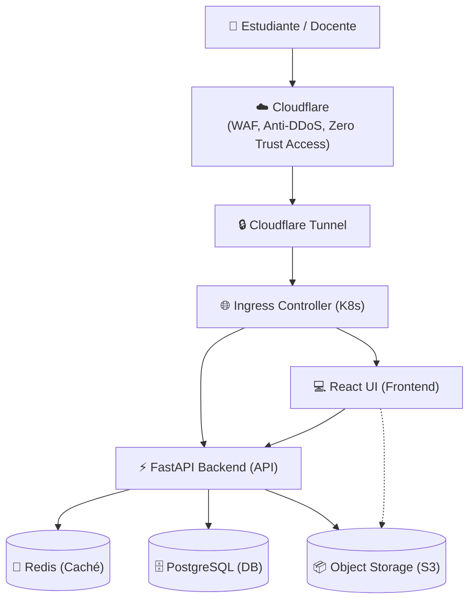

# 03. Arquitectura de Software

## 🏗️ Patrón Arquitectónico (Backend)

Utilizaremos la **Arquitectura por Capas (Layered Architecture)** adaptada para APIs modernas. Es el estándar de facto para FastAPI por ser pragmática, fácil de entender y mantener.

### Estructura de Capas

La aplicación se dividirá en 4 capas principales, con un flujo de control unidireccional:

1.  **Capa de Enrutamiento (Routers / Controllers):**
    *   **Función:** Recibe las peticiones HTTP, valida los tokens JWT y delega el trabajo a la capa de servicios.
    *   **Tecnología:** Endpoints de FastAPI.
2.  **Capa de Lógica de Negocio (Services):**
    *   **Función:** Contiene el "core" del proyecto y aplica las reglas de negocio. No sabe nada de HTTP ni de SQL puro.
    *   **Tecnología:** Clases o funciones puras de Python.
3.  **Capa de Acceso a Datos (Repositories / CRUD):**
    *   **Función:** Única capa autorizada para hablar con la base de datos (PostgreSQL).
    *   **Tecnología:** SQLAlchemy (ORM).
4.  **Capa de Modelos y Esquemas (Models & Schemas):**
    *   **Models:** Representan las tablas de PostgreSQL (SQLAlchemy).
    *   **Schemas:** Definen la estructura de los JSON (Pydantic).

## 📂 Estructura de Carpetas (Feature-Based)

```text
backend/
├── app/
│   ├── core/           # Configuración global, seguridad (JWT), conexión a DB.
│   ├── api/
│   │   ├── users/      # Dominio de Usuarios
│   │   │   ├── router.py   # Capa 1: Rutas HTTP
│   │   │   ├── service.py  # Capa 2: Lógica de negocio
│   │   │   ├── crud.py     # Capa 3: Acceso a DB
│   │   │   ├── models.py   # Capa 4: Tablas SQL
│   │   │   └── schemas.py  # Capa 4: Validadores JSON
│   │   ├── resources/  # Dominio Bibliográfico
│   │   └── labs/       # Dominio de Laboratorios
│   └── main.py         # Punto de entrada de FastAPI
```

## 📐 Flujos Técnicos

### Diagrama de Arquitectura de Alto Nivel



