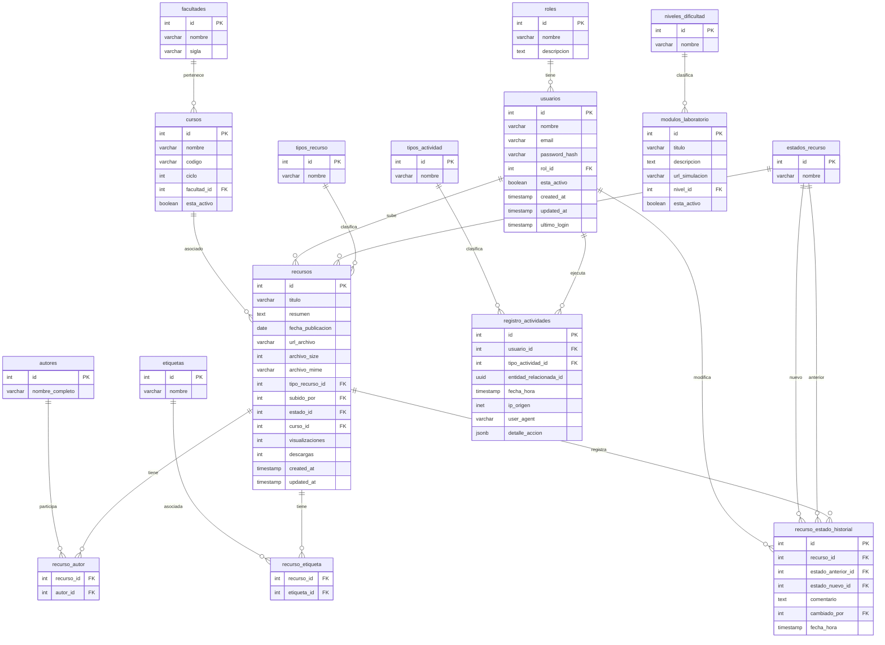

# 04. Modelo de Datos (3NF)

## 🗄️ Diseño de Base de Datos (PostgreSQL)

Modelo estrictamente normalizado hasta la Tercera Forma Normal (3NF) para garantizar la integridad y escalabilidad.

### Diagrama de Entidad-Relación (ERD)

### Detalle de Tablas y Atributos

### 1. Dominio de Usuarios (RBAC)
*   **`roles`**: `id` (PK), `nombre` (Admin, Docente, Estudiante), `descripcion`.
*   **`usuarios`**: `id` (PK), `nombre`, `email`, `password_hash`, `rol_id` (FK), `esta_activo`, `created_at`, `updated_at`, `ultimo_login`.

### 2. Dominio Académico y Bibliográfico
*   **`facultades`**: `id` (PK), `nombre`, `sigla` (ej. FIQ).
*   **`cursos`**: `id` (PK), `nombre`, `codigo`, `ciclo`, `facultad_id` (FK), `esta_activo`.
*   **`tipos_recurso`**: `id` (PK), `nombre` (Libro, Tesis, Artículo, Manual).
*   **`estados_recurso`**: `id` (PK), `nombre` (Pendiente, Aprobado, Observado, Rechazado, Archivado).
*   **`recursos`**: 
    *   `id` (PK), `titulo`, `resumen`, `fecha_publicacion`, `url_archivo`, `archivo_size`, `archivo_mime`, `tipo_recurso_id` (FK), `subido_por` (FK), `estado_id` (FK), `curso_id` (FK), `visualizaciones`, `descargas`, `created_at`, `updated_at`.
*   **`autores`**: `id` (PK), `nombre_completo`.
*   **`recurso_autor`**: `recurso_id` (FK), `autor_id` (FK).
*   **`etiquetas`**: `id` (PK), `nombre`.
*   **`recurso_etiqueta`**: `recurso_id` (FK), `etiqueta_id` (FK).
*   **`recurso_estado_historial`**: `id` (PK), `recurso_id` (FK), `estado_anterior_id` (FK), `estado_nuevo_id` (FK), `comentario`, `cambiado_por` (FK), `fecha_hora`.

### 3. Dominio de Laboratorios
*   **`niveles_dificultad`**: `id` (PK), `nombre` (Básico, Intermedio, Avanzado).
*   **`modulos_laboratorio`**: `id` (PK), `titulo`, `descripcion`, `url_simulacion`, `nivel_id` (FK), `esta_activo`.

### 4. Dominio de Trazabilidad (Auditoría Avanzada)
*   **`tipos_actividad`**: `id` (PK), `nombre`.
*   **`registro_actividades`**: `id` (PK), `usuario_id` (FK), `tipo_actividad_id` (FK), `entidad_relacionada_id` (UUID), `fecha_hora`, `ip_origen`, `user_agent`, `detalle_accion` (JSONB).

## 🔄 Flujo de Aprobación Académica

1.  **Carga (Pendiente):** El docente sube el recurso; visible solo para docente y admin.
2.  **Revisión:** El Administrador valida integridad y calidad académica.
3.  **Aprobado/Observado:** Se publica en la biblioteca o se devuelve al docente con comentarios.
