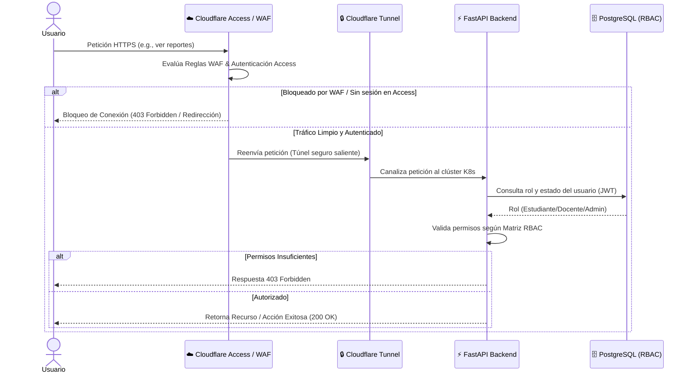

# 06. Seguridad y Zero Trust

## 🛡️ Seguridad de Red (Cloudflare Zero Trust)

Implementaremos un modelo **Zero Trust** para ocultar la infraestructura de ataques públicos y gestionar identidades.

*   **Cloudflare Tunnels:** No expondremos puertos abiertos. El clúster de K8s se conecta a Cloudflare mediante un túnel cifrado saliente (`cloudflared`).
*   **Cloudflare Access:** Capa de autenticación perimetral para paneles administrativos y herramientas internas.
*   **WAF (Web Application Firewall):** Mitigación automática de ataques L7 (DDoS, SQLi, XSS) en el borde de la red.

### Flujo de Acceso Seguro (Secuencia)

## 👥 Matriz de Permisos (RBAC)

| Módulo / Acción | Estudiante | Docente | Administrador |
| :--- | :---: | :---: | :---: |
| Buscar y Ver recursos | Sí | Sí | Sí |
| Subir recursos | No | Sí (Pendientes) | Sí |
| Aprobar recursos | No | No | Sí |
| Editar recursos | No | Solo propios | Sí |
| Ver Módulos de Lab | Sí | Sí | Sí |
| Ver Reportes | No | Solo de sus alumnos | Sí (Global) |
| Gestionar Usuarios | No | No | Sí |

## 🔐 Seguridad de Aplicación (Defensa en Profundidad)

*   **Sanitización de Datos:** Validación estricta con Pydantic en FastAPI para evitar inyecciones.
*   **Seguridad en Uploads:** 
    *   Verificación de **Magic Numbers** (MIME type real).
    *   Límite estricto de 20MB por archivo.
    *   Renombrado con UUIDs para evitar path traversal.
*   **Cabeceras de Seguridad:** Inyección de HSTS, CSP, X-Frame-Options y X-Content-Type-Options.
*   **Rate Limiting:** Límites de peticiones por usuario (JWT) para evitar abusos internos.
