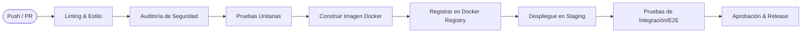

# 07. Infraestructura y DevOps

## 🌐 Entornos de Despliegue

1.  **Desarrollo (Local):** Uso de Docker Compose V2 con `compose.yaml` y el comando `docker compose` para orquestación local (API, DB, MongoDB, Redis y MinIO).
2.  **Pruebas / Staging (QA):** Namespace aislado en Kubernetes para validación de entregables.
3.  **Producción:** Clúster Kubernetes de alta disponibilidad.
    *   **Autoescalado Horizontal (HPA):** Configurado para escalar dinámicamente entre 2 y 8 réplicas por microservicio cuando el uso de CPU o memoria exceda el 70%.
    *   **Políticas de recursos:** Límites y solicitudes estrictas de CPU y RAM para garantizar estabilidad del clúster.

## ⚙️ Tubería CI/CD (GitHub Actions)

El ciclo de integración y despliegue continuo se ejecuta de manera automatizada para cada rama y pull request:

*   **Integración Continua (CI):** Ejecución de tests (Pytest, Jest), análisis estático de código y auditoría de seguridad (validaciones de dependencias y secretos) en cada Pull Request.
*   **Despliegue Continuo (CD):** Construcción automatizada de imágenes optimizadas de Docker y actualización progresiva (*Rolling Update*) en el clúster de Kubernetes, garantizando cero tiempo de inactividad (*Zero Downtime*).

## 📊 Observabilidad y Monitoreo

*   **Logs Centralizados:** Recolección de logs de todos los pods para auditoría técnica.
*   **Métricas en Tiempo Real:** Monitoreo de latencia (<2s), errores 5XX y consumo de recursos.
*   **Alertas Automáticas:** Notificaciones ante caídas del servicio o comportamientos anómalos.

## 💾 Respaldo y Recuperación ante Desastres (DRP)

*   **PostgreSQL:** Backups diarios automatizados con retención de 30 días en S3.
*   **Object Storage (S3):** Versionamiento activo de archivos académicos.
*   **RTO/RPO:** Tiempo de recuperación estimado menor a 2 horas mediante infraestructura como código.
