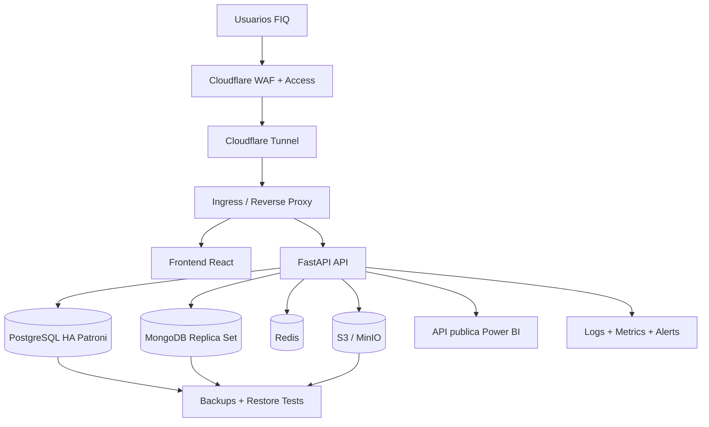

# 14. Plan de Producción HA, Kubernetes/Swarm y Power BI

## Decisión de Orquestación

Kubernetes y Docker Swarm no se deben mezclar como un único plano de control. Para FIQ se define:

- **Kubernetes:** destino recomendado para producción HA y evolución institucional.
- **Docker Swarm:** alternativa operativa si el equipo necesita un clúster más simple en VPS antes de adoptar Kubernetes.
- **Docker Compose:** entorno local y laboratorio, no frontera final de alta disponibilidad.

## Arquitectura Objetivo

## Fases

### Fase 0: Base ya disponible

- `compose.yaml` local con PostgreSQL, MongoDB, Redis, MinIO, backend y frontend.
- PostgreSQL HA iniciado con Patroni/etcd/HAProxy en `ha-database/`.
- MongoDB documental para `activity_events` y `external_catalog_cache`.
- API Power BI con `/reports/public/*` protegida por `DASHBOARD_API_KEY`.

### Fase 1: Hardening de Configuración

- Separar `compose.yaml` local y `compose.prod.yaml` si se mantiene VPS.
- Sacar secretos de archivos versionados: usar `.env.prod`, Docker secrets, Kubernetes Secrets o External Secrets.
- Definir rotación de `SECRET_KEY`, `DASHBOARD_API_KEY`, credenciales S3, PostgreSQL y MongoDB.
- Activar CORS explícito para frontend, Power BI y dominios institucionales.
- Evitar exponer puertos de bases de datos públicamente; solo red interna o VPN.

### Fase 2: MongoDB Seguro y HA

Objetivo: replica set de 3 miembros en nodos distintos.

- `mongo-0`, `mongo-1`, `mongo-2` con persistencia independiente.
- Autenticación obligatoria.
- Keyfile interno para autenticación entre réplicas.
- TLS interno si el clúster cruza redes no confiables.
- Usuario app con permisos mínimos sobre `fiq_events`.
- Usuario backup solo lectura.
- Backups con `mongodump --oplog` o snapshots consistentes.
- Restore test mensual en entorno aislado.

### Fase 3: PostgreSQL HA

Mantener Patroni/etcd/HAProxy como línea base:

- 3 nodos PostgreSQL.
- 3 nodos etcd o servicio equivalente estable.
- HAProxy o PgBouncer para entrada estable.
- Backups base + WAL archiving.
- Restore test documentado.
- Métricas de replicación, lag y failover.

### Fase 4: Kubernetes

Crear `infra/k8s/` con:

- `Namespace` por entorno: `fiq-staging`, `fiq-prod`.
- `Deployment` para backend, frontend y cloudflared.
- `Service` interno para backend/frontend.
- `Ingress` si no se usa solo Cloudflare Tunnel.
- `ConfigMap` para configuración no sensible.
- `Secret` o ExternalSecret para credenciales.
- `CronJob` para backups.
- `NetworkPolicy` para aislar bases de datos.
- Probes: readiness/liveness/startup.
- Requests/limits por pod.
- HPA para backend y frontend.

Base de datos en Kubernetes:

- Preferible usar operadores: CloudNativePG/Zalando para PostgreSQL y MongoDB Community/Enterprise Operator para MongoDB.
- Si no se usan operadores, mantener Postgres/Mongo fuera del clúster y conectar por red privada/VPN.

### Fase 5: Docker Swarm Fallback

Crear `infra/swarm/` con:

- Stack file `fiq-stack.yaml`.
- Overlay network.
- Docker secrets.
- Replicas de backend/frontend.
- Servicios externos para PostgreSQL HA y Mongo replica set.
- Rolling update y rollback config.
- Healthchecks obligatorios.

Swarm no debe administrar datos críticos sin una estrategia clara de volúmenes por nodo, backups y recuperación.

### Fase 6: Observabilidad

Mínimo aceptable:

- Logs centralizados del backend, frontend, cloudflared, PostgreSQL, MongoDB y backups.
- Métricas HTTP: latencia p95, 4XX, 5XX, throughput.
- Métricas DB: conexiones, locks, replicación, tamaño, cache hit, slow queries.
- Alertas: API caída, error 5XX alto, disco > 80%, backup fallido, replica lag, Mongo primary no disponible.
- Dashboard técnico separado del dashboard académico Power BI.

### Fase 7: Power BI

No conectar Power BI directo a PostgreSQL ni MongoDB. Usar API pública controlada:

- `GET /reports/public/dashboard-data`
- `GET /reports/public/resources`
- `GET /reports/public/courses`
- `GET /reports/public/users`
- `GET /reports/public/activities`
- `GET /reports/public/document-metrics`

Seguridad:

- `DASHBOARD_API_KEY` obligatorio.
- Cloudflare WAF/rate limit.
- Respuestas agregadas, no secretos ni tokens.
- No exponer contraseñas, URLs internas ni campos sensibles.
- Logs de acceso para auditoría.

Modelo Power BI:

- Tabla `resources`: recursos, tipos, cursos, vistas, descargas.
- Tabla `activities`: eventos SQL por fecha/tipo.
- Tabla `document_metrics.activity_events.by_type`: eventos Mongo por tipo.
- Tabla `document_metrics.activity_events.by_date`: eventos Mongo por fecha.
- Tabla `document_metrics.external_catalog_cache.by_kind`: búsquedas externas por tipo.
- Tabla `document_metrics.external_catalog_cache.recent`: snapshots recientes del cache externo.

## Criterios de Listo

- `docker compose config` sin warnings.
- `uv run --extra dev python -m pytest` pasando.
- `npm run openapi:check` pasando.
- Secretos fuera del repo.
- Backups ejecutados y restore probado.
- Endpoint Power BI con API key y dataset validado.
- Runbook de failover PostgreSQL y MongoDB.
- Monitoreo con alertas probadas.
